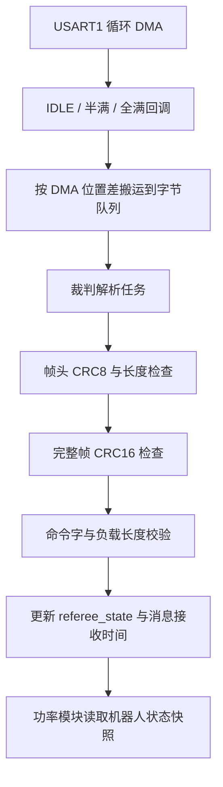

# 裁判接收模块

## 已配置的接口

串口和 DMA 分配参照双板模板 `DM-MC02.ioc`，配置同时写入当前下板 `.ioc` 和对应外设代码，无需再手动增加串口配置。

| 项目 | 配置 |
| --- | --- |
| 串口 | USART1，115200，8 数据位，无校验，1 停止位，无流控。 |
| 引脚 | PA9 TX / PA10 RX，AF7。 |
| 接收 DMA | DMA1 Stream4，USART1_RX 请求，循环模式，字节对齐，内存递增，高优先级。 |
| 中断 | USART1 与 DMA1 Stream4，抢占优先级 5；IDLE、半满和全满回调保留。 |
| 解析任务 | `referee`，普通优先级，栈 1024 字节，每 2 tick 处理一次。 |

接线：**裁判系统学生串口 TX → 下板 PA10，GND → 下板 GND**。只接收数据时可不接 PA9；如果以后增加裁判发送功能，再把 PA9 接裁判 RX。使用学生接口的串口信号，电源线按板卡说明连接。

当前 UART5 的遥控配置仍按工程原设置。下板 USART1 的引脚和 DMA Stream4 与现有外设没有配置冲突。芯片引脚名到板上插座的对应关系需按实物板卡丝印/原理图确认。

## 数据读取

Keil 可以直接展开：

```c
referee_state.info.robot_status.chassis_power_limit
referee_state.info.robot_status.power_management_chassis_output
referee_state.info.robot_status.shooter_barrel_cooling_value
referee_state.info.robot_status.shooter_barrel_heat_limit
referee_state.info.power_heat_data.shooter_17mm_1_barrel_heat
referee_state.info.power_heat_data.buffer_energy
referee_state.message[REFEREE_MSG_robot_status]
referee_state.diagnostics
referee_uart_diagnostics
```

程序控制时使用快照接口，避免解析任务写入时读取到混合字段：

```c
RefereeRobotStatus_t status;
if (Referee_GetRobotStatus(&status, HAL_GetTick()))
{
    // status 仅在机器人状态帧新鲜时可用。
}
```

`Referee_GetRobotStatusSnapshot()` 读取最后有效状态及其原始接收时间，过期后仍可读，供功率观测显示最后收到的上限与许可。`Referee_GetPowerHeat()` 返回新鲜热量数据。`Referee_GetState()` 是完整快照，结构体较大，避免在电机任务的小栈上创建完整对象。

数据保留最后有效值，所以看到了数值不代表它还在线。检查对应 `message[].valid / fresh / last_rx_ms`；整体 `diagnostics.online` 表示近期存在 CRC 正确的完整帧，不代表功率上限帧新鲜。

## 协议版本

核心格式按本地 2026 通信协议 V2.0.0（20260626）核对，并保留明确的 V1.3 兼容布局：

- `0x0201` 支持 V1.3 的13字节和 V2.0 的17字节。功率上限均在偏移10，输出许可分别在偏移12和16。
- `0x0003` 支持16/20字节，按版本处理伤害差和对方建筑血量。
- `0x0202` 为14字节，前8字节为保留位，不作为实时功率使用；保留缓冲能量和枪管热量解析。
- `REFEREE_TEMPLATE_LAYOUT=1` 仅启用模板雷达/视频扩展，不影响核心状态帧布局。

其他模板负载类型保留在 `referee_wire.h`，按固定长度解析；无法匹配的命令/负载只保留原始数据和诊断计数。模板雷达、视频私有命令默认不参与字段解析。移植到其他赛季时，应逐项核对实际要使用的命令定义。

裁判上限与输出许可用于超电实测功率闭环。超电 `0x222` 同步底盘上限，明确断电时关闭基础使能。缓冲字段保持外设配置值，软件不使用缓冲能量控制。

## 接收流程



中断只搬运字节，解析在任务执行。解析器处理半帧、粘包、噪声、超长头、CRC 错误和残帧超时。队列丢字节时丢弃残帧重新同步；UART 错误由任务中止并重新启动接收。

DMA 缓冲为 512 字节并按 Cache 行对齐，当前 Keil 链接到 AXI SRAM，DMA1 可访问；启用 DCache 时做缓存维护。移植时不能把 DMA 缓冲放到 DMA1 无法访问的 DTCM。

## 文件与移植

| 文件 | 职责与适用范围 |
| --- | --- |
| `referee.[ch]` | 纯 C 字节流解析及一致快照，不依赖 HAL/RTOS，可移植到其他 MCU 或上位机重放。 |
| `referee_wire.h` | 紧凑负载类型，ARMCC/GCC 支持，换编译器需核对 packed 定义。 |
| `referee_uart.[ch]` | STM32H7 HAL 循环 DMA 接收与队列适配；其他系列需更换 HAL 头文件并处理 Cache/内存差异。 |

移植步骤：

1. 复制解析文件，核对所用赛季的负载定义和超时。
2. CubeMX 配置串口、循环 RX DMA、USART/DMA 中断，DMA 数组放在控制器可访问的内存。
3. 初始化调用 `Referee_Init()`，串口初始化后调用 `RefereeUart_Start(&目标串口)`。
4. 唯一的 HAL RX 事件回调分发到 `RefereeUart_OnRxEvent()`，错误回调分发到 `RefereeUart_OnError()`；当前回调位于 `Core/Src/usart.c` 的 USER CODE 区。
5. 唯一任务周期调用 `RefereeUart_Process()`，其他任务只读快照。解析任务在 FreeRTOS USER CODE 区创建，避免 CubeMX 再创建同名任务。
6. 检查 `rx_event_count`、`valid_frame_count`、目标命令 `rx_count` 是否持续增加，再检查功率模块的 `referee_fresh`。

本机重放测试在根目录 `验证/功率与裁判/`，包含实际解析、循环 DMA 适配，以及裁判/超电/电机/PID 观测连接测试。测试不连接实物。


## V2.0 状态帧兼容修正

核对本地《RoboMaster 2026 机甲大师高校系列赛通信协议 V2.0.0（20260626）》：`0x0201` 数据段为17字节，偏移10是底盘功率上限，偏移12是4字节射击初速度上限，偏移16是电源输出许可。旧版13字节状态帧的许可位在偏移12。解析器根据这两种明确长度分别读取，不接受其他长度；CRC校验保持不变。

`0x0003` 支持旧版16字节和V2.0的20字节，20字节增加对方前哨站/基地血量，偏移8为伤害差。`REFEREE_TEMPLATE_LAYOUT` 仅控制模板雷达/视频扩展，不再切换核心状态帧。

Keil查看 `referee_state.message[6].received_frame_count`、`received_payload_length` 和 `rx_count`：前者是CRC正确的机器人状态帧数，中间是最近数据段长度，最后是解析成功次数。收到字节数不能与有效帧数直接比较，一帧包含帧头、命令字、数据段和CRC多个字节；应使用CRC错误次数判断接收质量。
