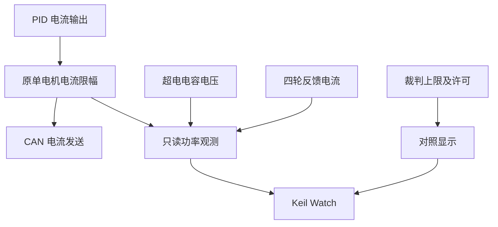

# 底盘功率观测

当前主反馈改为超电 `0x211` 前两字节直接上报的底盘功率，按已确认的原值单位 W 使用。功率闭环在发送前统一缩放四轮电流，速度环撤回加剧限流的新增积分。原电压与力矩电流乘积只留作诊断，不参与功率控制。原来的单电机电流限幅、PID 自带的积分/输出限幅、遥控和电机离线停车仍按原工程执行。

## 计算

模板超电电压取自 CAN `0x211` 字节 2～3，有符号小端整数：

```text
电容电压 = (voltage_raw + 32000) × 25 / 64000
反馈估算功率 = 电容电压 × 四轮反馈电流绝对值之和 × estimate_gain
指令估算功率 = 电容电压 × 四轮待发电流绝对值之和 × estimate_gain
```

反馈与指令分别使用 `feedback_a_per_raw` 和 `command_a_per_raw` 换算为 A；两者暂按 `20/16384` 初始化，反馈比例需独立核对。方向相反的电流不会抵消。零电压可得到有效零功率；电压不会加下限，也没有备用值。电压过期或无效时功率清零且有效标志为 false，不能把它当成实际零功率。

这是力矩电流与电容端电压的乘积，不是裁判侧真实输入功率。超电返回的 `chassis_power_raw` 保留原值，不假定其单位。

## Keil Watch

添加 `chassis_power_state` 并展开：

| 成员 | 含义 |
| --- | --- |
| `estimate.feedback_estimate_w` | 优先观察这个：四轮反馈电流的功率乘积估算。 |
| `estimate.output_estimate_w` | 待发电流指令的功率乘积估算。 |
| `estimate.feedback_estimate_valid` | 电压、四轮反馈及换算参数有效时为 true。 |
| `estimate.output_estimate_valid` | 电压与指令换算参数有效时为 true。 |
| `estimate.feedback_current_a[]` | 四路有符号反馈电流换算值。 |
| `estimate.feedback_current_abs_sum_a` | 四轮反馈电流绝对值之和。 |
| `estimate.output_current_abs_sum_a` | 四轮待发指令电流绝对值之和。 |
| `capacitor_voltage_v` | 超电返回的电容电压，不加人为下限。 |
| `feedback_raw[]`、`output_raw[]` | 四路反馈电流原值、准备发送的电流指令。 |
| `referee_limit_w`、`referee_output_allowed` | 最后收到的裁判上限与输出许可，仅作对照。 |
| `referee_fresh`、`capacitor_fresh`、`feedback_fresh` | 对应来源是否新鲜。 |

`chassis_power_config` 只影响旧乘积诊断；实际限流参数见下方 `chassis_power_control_config`。

## 结构与移植



- `chassis_power_estimate.[ch]` 是纯 C 四电机观测算法，不依赖 HAL、PID、RTOS 或麦轮解算。输入电流为 const，不会修改。复制到其他工程时填好电压、有效标志、四轮电流和换算比例后调用 `ChassisPowerEstimate_Calculate()`。
- `chassis_power.[ch]` 读取本板超电、裁判及电机快照，在电机发送前调用 `ChassisPower_Update()`，只更新观察结构体。迁移时替换数据来源。
- 超电控制帧的底盘上限改由裁判/备用策略提供，充放电参数仍在 `power_communication_config`。
- 裁判 USART1 接收和解析继续保留，接线及移植步骤见 `bottom_driven/referee/README.md`。

根目录 `验证/功率与裁判/run.py` 检查实际观测、电机发送、PID 及裁判模块：验证超电功率反馈闭环、重复样本、掉线、裁判断电、统一缩放、速度环积分抑制以及关闭功率闭环后的原电流指令。

## 超电功率反馈限流

优先观察：

| Watch 成员 | 含义 |
| --- | --- |
| `chassis_power_state.power_w` | 超电直接上报的实际功率，原值直接按 W 使用。 |
| `chassis_power_state.target_w` | 当前有效上限减去功率余量后的目标。 |
| `chassis_power_state.current_scale` | 四轮统一电流比例，范围 0～1。 |
| `chassis_power_state.limited` | 本周期是否缩小了电流。 |
| `chassis_power_state.power_feedback_valid` | 超电功率帧是否新鲜；不依赖电压是否有效。 |
| `chassis_power_state.referee_fresh` | 裁判机器人状态是否新鲜。 |
| `chassis_power_state.request_raw[] / output_raw[]` | 功率限流前后的四轮电流指令。 |

配置在 `user/application_config.c` 的 `ChassisPowerConfig_Init()`，展开 `chassis_power_control_config` 可调：

| 参数 | 默认值 | 用途 |
| --- | --- | --- |
| `enabled` | true | 开启功率反馈闭环；关闭后仍遵守裁判断电许可。 |
| `offline_limit_w` | 60 W | 无裁判时的调试上限，并非比赛固定规则值。 |
| `reserve_w` | 5 W | 从上限扣除的余量。 |
| `deadband_w` | 1 W | 目标附近停止积分的误差范围。 |
| `kp` | 0.5 | 相对功率误差的比例增益。 |
| `ki_per_s` | 3 | 电流比例积分的每秒增益。 |
| `recovery_per_s` | 1 | 比例恢复的每秒上升限幅。 |
| `initial_scale` | 0.3 | 上电、反馈恢复时的初始电流比例。 |
| `offline_current_limit` | 1000 | 超电反馈失效时，每轮的原始电流上限，四轮仍统一缩放。 |

每个新功率样本计算一次 `误差=(目标-实测)/目标`，PI 输出四轮统一比例。功率超限时允许立即收紧；比例增加受恢复速度限制。重复读取同一帧不重复积分；目标改变可立即更新比例项。零电流期间保持闭环比例，防止停机时因低功率把比例恢复到最大。

裁判状态过期时，备用上限与最后有效裁判上限取较小值。零上限和明确断电不会因超时自动解除；新的有效机器人状态可更新许可。超电反馈过期时，不用旧功率继续积分，改用备用原始电流限幅。接收帧为零功率与没有收到帧分开处理。负功率作为回馈值显示，闭环不把它计为正向消耗超限。

超电 `0x222` 的底盘上限字段同步裁判/备用上限，明确断电时关闭基础使能。控制不使用缓冲能量，不叠加超电增功率额度。原有遥控、电机离线停车继续生效。

这是反馈控制，受超电反馈周期、CAN 延迟及电机响应影响，不能保证每个瞬间都不超限。上车后用超电反馈和裁判实测检查突加速、连续旋转、制动和负载变化，再调余量与增益。

复用算法时复制 `chassis_power_control.[ch]`，初始化控制器，每个新功率样本传入功率、目标和实际时间间隔，得到电流统一比例。它不依赖 HAL、RTOS、电机或矩阵库；输入适配、掉线处理和速度环积分抑制由当前工程负责。
