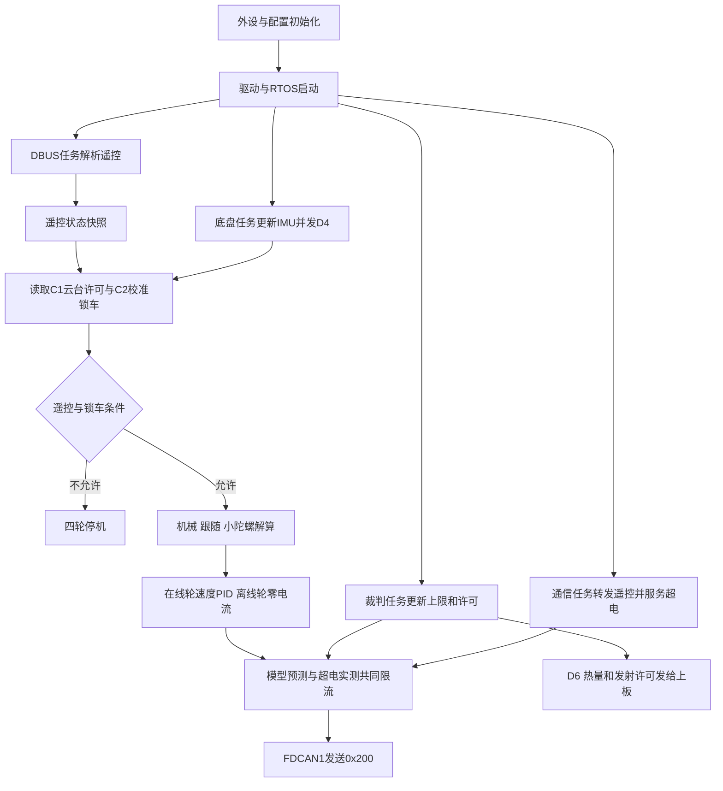

# 下板启动与任务

## 文件和启动

入口在 `Core/Src/main.c`，任务在 `Core/Src/freertos.c`。外设初始化后加载 `LowerPeripheralConfig_InitAll` 与 `LowerApplicationConfig_InitAll`，初始化裁判/功率/超电状态并启动USART1循环DMA，再初始化3508、两路FDCAN、BMI088和DBUS，最后启动RTOS。设备初始化失败进入Error_Handler。

## 任务与数据流

| 任务 | 周期参数/节拍 | 职责 |
| --- | --- | --- |
| `Control_Parsing` | `remote_config.task_period_ticks` | DBUS取帧、解析、在线检测、遥控状态更新 |
| `motor3508` | `chassis_config.task_period_ticks` | IMU更新、D4上报、读取遥控/C1/C2、锁车与模式判定、四轮控制、D5上报 |
| `communication` | `remote_config.period_ticks` | 板间Bus-Off服务、超电服务、D1～D3原始遥控转发 |
| `referee` | 代码内osDelay节拍 | 循环DMA队列消费、CRC、消息解析、新鲜度维护及D6热量转发 |

## 安全判定与观察量

遥控离线、调头等待或C2锁车时停四轮。单个轮子未收到反馈或反馈过期时，仅该轮持续发送零电流，其余在线轮继续执行当前模式；反馈恢复后该轮自动恢复。上板低位联锁将跟随/小陀螺临时改为机械模式。小陀螺执行条件：本地选中小陀螺、C1许可有效、手动使能。

`rc_task_frame_count` 是任务成功解析的遥控计数；`chassis_spin_stop_count` 记录自旋从驱动变为禁止的次数；`chassis_spin_block_reason`：

| 数值 | 原因 |
| --- | --- |
| 0 | 未处于小陀螺，或没有阻止原因 |
| 1 | 本地未使能自旋 |
| 2 | 上板模式帧过期/无效 |
| 3 | 上板未选中小陀螺 |
| 4 | 上板未给自旋许可 |
| 5 | 持续失去许可后等待重新手动布防 |
| 6 | 遥控离线，调头或校准锁车 |
| 7 | 上板升降低位联锁 |

## 修改与移植

适用于HAL+FreeRTOS任务组织。保留单一裁判解析任务和遥控写入任务，各控制任务读快照。不得把矩阵大对象放进较小任务栈；初始化顺序要先配置再启动设备。CubeMX重生成需复核DMA/中断、两路FDCAN Message RAM、任务创建和USER CODE；改节拍同步检查PID时间和斜坡。

## 常用观察变量

这些计数用于判断数据流是否推进。下板目前没有与上板同名的任务超期结构体。

| Watch 表达式 | 单位 / 类型 | 含义 |
| --- | --- | --- |
| `rc_rx_frame_count` | 帧 | DBUS 底层识别的完整帧数。 |
| `rc_task_frame_count` | 帧 | 遥控任务校验与解析成功次数。 |
| `communication_rx_count` | 帧 | 板间 C1/C2 收帧累计数。 |
| `chassis_imu.update_count` | 次 | 底盘任务成功更新姿态次数。 |
| `referee_uart_diagnostics.received_byte_count` | 字节 | 裁判接收回调搬入队列的累计字节数。 |
| `referee_state.diagnostics.parsed_frame_count` | 帧 | 裁判任务成功解析内容的累计次数。 |
| `power_communication_state.control.tx_count` | 帧 | 超电控制命令成功入队次数。 |
| `chassis_spin_block_reason` | uint8 | 当前小陀螺被拦截的原因，数值对照见本页。 |
| `chassis_spin_stop_count` | 次 | 自旋从驱动状态变为禁止状态的累计次数。 |

完整速查与观察方法见 [本板观察变量速查](00_观察变量速查.md)。

[返回工程首页](../README.md)
