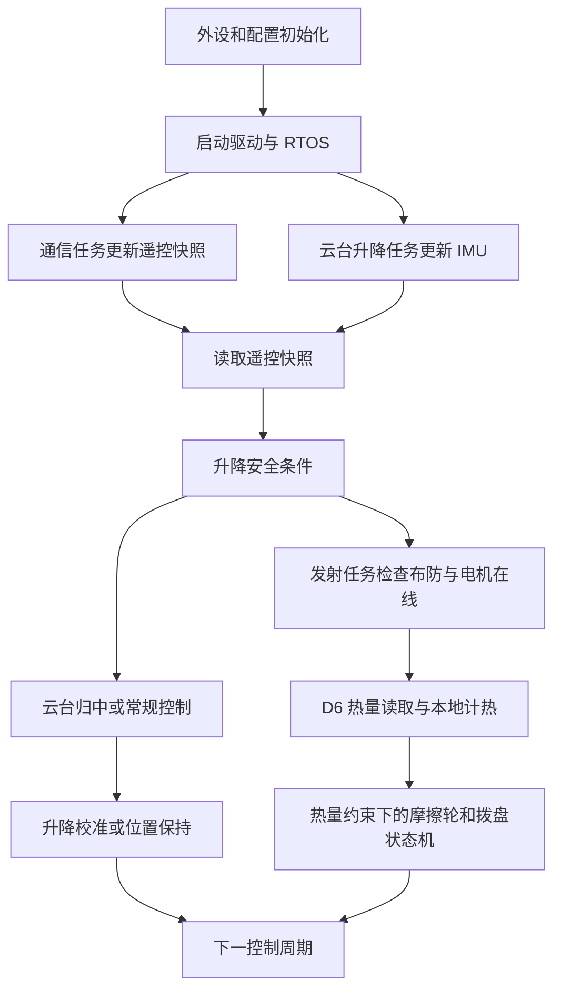

# 上板启动与任务

## 职责与文件

`Core/Src/main.c` 初始化外设和模块，`Core/Src/freertos.c` 创建任务，`user/upper_tasks.c` 实现周期入口。生成的 HAL/RTOS 代码在 Core；应用逻辑在 user。

## 启动和每周期逻辑

启动顺序：CubeMX 外设 → `UpperPeripheralConfig_InitAll()` / 应用配置 → IMU、电机、通信初始化 → RTOS。初始化失败进入 `Error_Handler()`。驱动在线表示反馈有效；机械归中与升降校准在后续控制周期运行。

| 周期入口 | 处理顺序 | 周期入口参数 |
| --- | --- | --- |
| `UpperTasks_RunCommunication` | 取板间 DBUS → `RemoteState_Update` | `upper_communication_task_config.period_ticks` |
| `UpperTasks_RunControl` | IMU 更新 → 2006 心跳 → 取同一遥控快照 → 升降安全快照 → 云台 → 升降 | `cloud_config.control_period_ticks` |
| `UpperTasks_RunShoot` | 摩擦轮/拨盘心跳 → 遥控与升降许可 → 手动布防 → 热量预测与校准 → 发射状态机 | `shoot_config.control_period_ticks` |

实际字段名以 [参数表](10_配置与调参.md) 为准。任务用 `osDelayUntil` 保持节拍；周期单位 tick，PID 周期单位秒，不能混用。

## 观察变量与排查

- `upper_task_timing.communication_overruns/gimbal_overruns/shoot_overruns`：任务超期次数，持续增长时先检查耗时与总线发送。
- `upper_shoot_block_reason`：发射被阻止原因，见 [发射模块](05_发射机构.md)。
- 遥控快照通过 `RemoteState_Get` 读取，升降快照通过 `LiftControl_SafetyGet` 读取。`volatile` 本身不能保证整个结构体读写一致。

## 修改与移植

同系列 STM32 + HAL + FreeRTOS 工程可参考任务组织方式。移植时先配置 CAN/SPI/RTOS，加入模块与头文件路径，再按 main 的顺序初始化。保留安全快照先于云台的顺序，避免下降请求晚一个周期生效。中断只接收和搬运，不在中断内做完整控制。任务周期改变后同步核对 PID 时间、堵转计数及通信超时。

[返回工程首页](../README.md)
