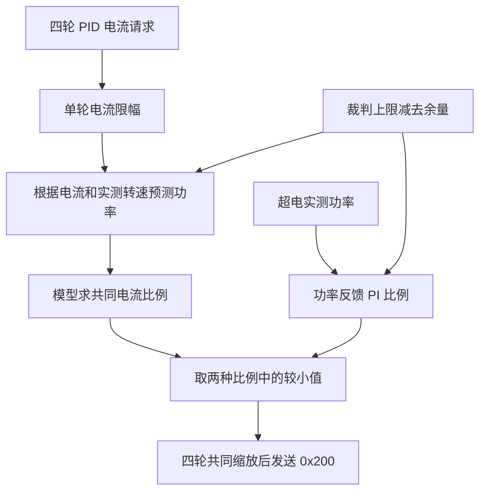

# 底盘功率控制

## 文件与执行位置

`chassis_power_model.[ch]` 预测电机功率并求电流比例，`chassis_power_control.[ch]` 根据超电实测功率更新反馈比例，`chassis_power.[ch]` 接入裁判、超电和四轮反馈。速度、位置和直接电流命令在发送前统一经过 `ChassisPower_Apply()`。

## 六项电机模型

单轮模型为 `P = k0 + k1·I + k2·n + k3·I·n + k4·I² + k5·n²`。

- `I` 是待发送的 C620 电流原始码，直接使用该原值。
- `n` 是该电机反馈的转子转速，单位 rpm。
- `P` 单位 W。四轮预测只累加各轮正功率，回馈轮不抵消其他轮消耗。
- `chassis_power_model_config.coefficient[轮索引][项索引]` 保存系数，轮索引按电机 ID 1～4，项索引对应上述六项。

固定实测转速，对四轮电流同时乘比例 `s`，通过二分求解预测功率不超过目标的可用比例，并预留电流取整的功率余量。统一缩放保留四轮请求比例。

零电流端预测已超额度时撤销驱动电流。此时转速损耗仍可能使预测高于目标，需要实际转速降低；当前缩放不会主动增加反向制动力。

## 超电实测反馈

`power_communication_state.capacitor.chassis_power_raw` 直接按 W 使用，观察值保留正负符号，反馈控制将负功率按零消耗处理。

相对误差为 `(target_w−power_w)/target_w`，PI 输出限制在 0～1。超限时立即允许收紧，恢复按 `recovery_per_s` 限制上升速度。只在新样本到达时积分，重复读取同一帧不积分；目标变化时立即重算比例项。

最终比例为 `min(model_scale, feedback_scale)`。模型约束即将发送的电流，实测反馈修正预测误差。电机 PID 在后级限流继续加重饱和时撤回本周期新增积分，反向误差仍允许积分退出饱和。

## 裁判与异常处理

新鲜机器人状态的 `chassis_power_limit` 给动态上限，扣去 `reserve_w` 得到目标。未接裁判时使用 `offline_limit_w`，过期后备用上限不高于最后有效裁判上限，最后的明确断电许可继续生效。

超电过期后仍保留模型约束，同时共同缩小四轮最大电流到 `offline_current_limit` 并重置反馈 PI。电机反馈缺失或过期、模型/控制参数非法、裁判禁止输出或有效上限为零时，开启控制的电流输出为零。

`enabled=false` 停用模型和反馈功率缩放；裁判明确禁止输出仍生效。缓冲能量未参与当前控制。

## Watch 变量

以下成员均位于 `chassis_power_state`。

| 成员 | 含义 |
| --- | --- |
| `power_w` / `target_w` | 超电实测功率、扣除余量后的目标，W |
| `predicted_request_w` / `predicted_output_w` | 限流前请求、实际发送电流对应的预测功率，W |
| `model_scale` / `feedback_scale` / `current_scale` | 模型、实测反馈、最终电流比例 |
| `referee_limit_w` / `referee_fresh` / `referee_output_allowed` | 最后裁判上限、新鲜度和输出许可 |
| `motor_feedback_valid` / `power_feedback_valid` | 转速和超电反馈有效性 |
| `model_valid` / `control_config_valid` | 两类参数检查结果 |
| `speed_rpm[4]` / `feedback_raw[4]` | 实测转子转速、反馈电流原值 |
| `request_raw[4]` / `output_raw[4]` | 限流前后电流原值 |
| `limited` / `power_sample_count` | 限流状态、功率样本次数 |

## 调参与移植

默认参数在 `user/application_config.c`。模型为 `chassis_power_model_config`，总开关、余量、反馈 PI、恢复速度和失联限幅为 `chassis_power_control_config`，完整字段见 [配置与调参](11_配置与调参.md)。先比较 `predicted_output_w` 与 `power_w` 在匀速和加减速时的误差，再调整余量及反馈增益。

模型和反馈模块可用于 C620/3508 底盘，只依赖标准 C 库。移植时复制三个模块、配置和初始化函数，将 `ChassisPower_Apply()` 接到四轮唯一发送出口，提供转子 rpm、C620 指令原值、实际功率、动态上限及输出许可。电机、减速机构和负载改变后重新核对系数与测量位置。

预测误差与反馈延迟仍会带来短时实测偏差，需要实车验证猛烈加减速。预测约束通过仍需核对实际功率。

[返回工程首页](../README.md)
