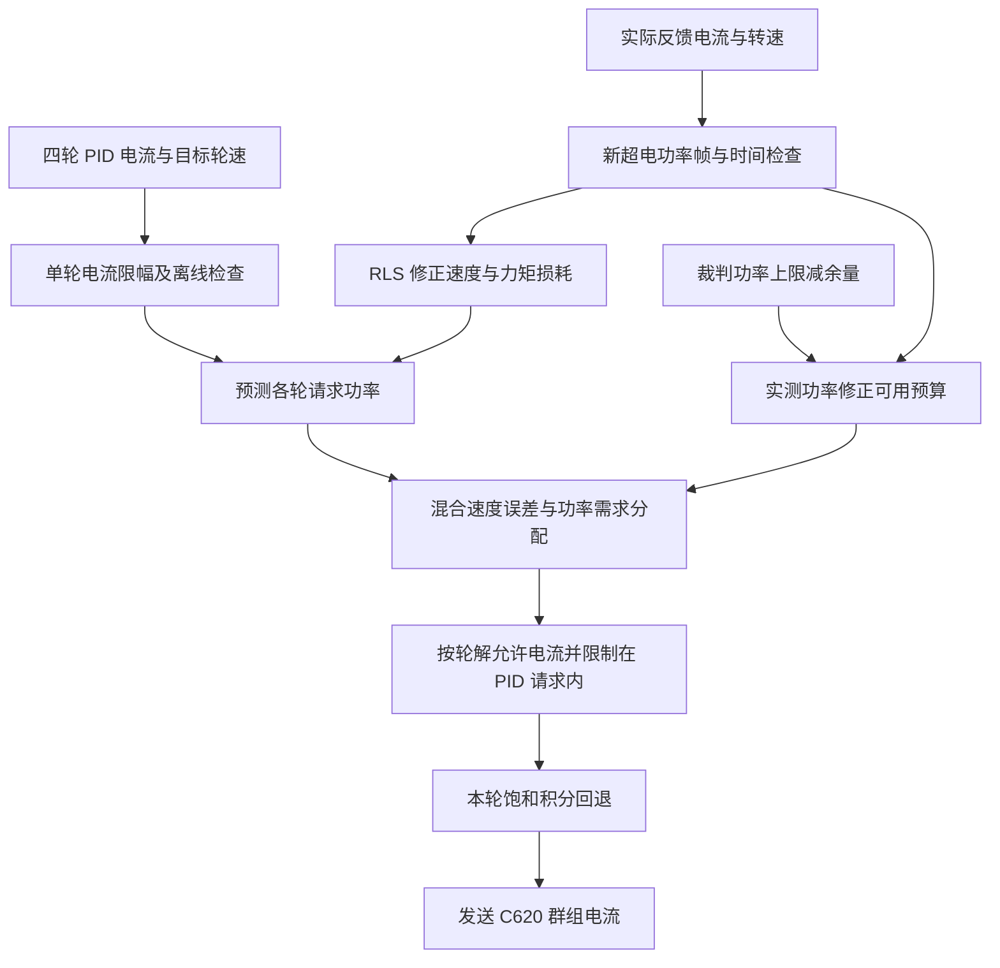

# 底盘自适应功率控制

## 文件与执行位置

- `algorithms_library/rls/rls2.[ch]`：两参数递推最小二乘，只依赖标准 C 库。
- `user/chassis/power/chassis_power_model.[ch]`：力矩功率模型、在线辨识和四轮功率分配。
- `chassis_power_control.[ch]`：用超电实测功率修正模型可用预算。
- `chassis_power.[ch]`：接入裁判上限、超电功率、在线轮反馈及闭环目标。
- `config/application_config.[ch]`：模型、学习、分配与反馈修正的默认参数。

设计参考 [HKUST ENTERPRIZE RM2024-PowerModule](https://github.com/hkustenterprize/RM2024-PowerModule)，按本工程接口重新写成 C。采用其两项损耗在线辨识和速度误差混合分配思路，电流求解、异常处理和数据入口适配当前工程。功率预算继续使用裁判上限，超电额外能量和裁判缓冲能量未参与预算提升。

速度、位置和直接电流命令经过电机唯一发送出口。速度与位置闭环传入本周期的目标转子 rpm；直接电流命令没有速度目标，按功率需求分配。上板协议保持现有格式。

## 功率模型与单位

单轮功率：

`P_i = torque_i × omega_i + k1 × abs(omega_i) + k2 × torque_i² + static_loss_w / 4`

- `torque_i = current_raw × motor.torque_nm_per_raw`，单位 N·m，使用减速器输出轴力矩。
- `omega_i = rotor_rpm × π / (30 × motor.reduction_ratio)`，单位 rad/s，使用减速器输出轴角速度。
- 待发送电流用于预测请求与输出功率；实际反馈电流用于在线学习。
- `k1` 描述随速度变化的损耗，`k2` 描述随力矩平方变化的损耗，固定损耗由配置给出。
- 默认电流换算使用 C620 电流码范围和 M3508 输出轴力矩常数；减速比使用 M3508 传动比。更换电机或电调后需重新配置。

在线学习使用四轮带符号总功率，减去机械功率与固定损耗后辨识两项损耗系数。输出限额只累计在线轮正功率，回馈轮不增加其他轮的可用额度。

## RLS 在线辨识

每个新超电功率帧最多使用一次。只有四轮均在线、每轮反馈与功率帧时间差在 `learning.alignment_window_ms` 内，才进行学习。正功率低于学习门槛、回馈功率、过大的预测残差及非法量测会跳过更新。

回归向量：`x = [sum(abs(omega)), sum(torque²)]`。

量测：`y = measured_power − sum(torque × omega) − static_loss_w`。

`rls2_algorithm.ops.update()` 更新两个系数及协方差；协方差使用 Joseph 形式，避免初始不确定度较大时相减丢失精度。参数限制在各自配置范围内。没有足够变化的电流和速度时，两项损耗难以分别确定，需要结合运动数据看收敛情况。

修改电机换算、模型初值或初始协方差后重新建立辨识状态。下板重启也会清除学习结果，当前未写入 Flash。`learning.enabled=false` 可暂停辨识并使用已学参数。在线修改学习门槛、遗忘系数或分配门槛保留学习历史；修改系数边界会立即限幅。

时间检查依据接收时间。超电自身测量延迟仍会影响峰值拟合，需结合实车记录检查。

## 按轮分配

总预测功率没有超过修正预算时，保留各轮原请求。超过预算后：

1. 为各轮的速度与固定损耗预留功率。
2. 计算在线轮的总速度误差，将分配权重在功率需求和速度误差之间线性切换。
3. 总误差低时主要按各轮额外功率需求分配；总误差高时主要按速度误差分配。
4. 某轮请求满足后，将剩余额度分给其余轮，避免有额度闲置。
5. 用功率二次方程求允许电流，保持请求方向，限制在原 PID 请求幅值内。分配时预留电流取整对应的功率余量。

误差切换门槛的单位是各轮**输出轴 rad/s 的绝对误差总和**，配置为 `allocation.error_blend_low_rad_s` 和 `error_blend_high_rad_s`。误差大时，落后较多的轮子获得更多额度。

仅速度和固定损耗已超过预算时撤销正功率轮的驱动电流，保留请求中正在回馈的轮。此时实际转速下降需要时间，模型预测损耗也可能暂时高于预算。

## 实测反馈与裁判上限

`power_communication_state.capacitor.chassis_power_raw` 直接按 W 使用，保留原有功率反馈协议。观察值保留负号，预算修正将负功率按零消耗处理。

预算反馈使用相对误差 `(target_w − measured_w) / target_w`。PI 输出为预算比例，范围 0～1，只在新功率帧或功率目标变化时更新；积分只使用新帧间隔。超限允许立即收紧，恢复按 `recovery_per_s` 限制速度。

`allocation_budget_w = target_w × feedback_scale`。

PI 修正的是分配器的总功率预算。四轮分别计算电流，不再共同乘同一个反馈电流比例。预算从完整目标开始，原配置 `initial_scale` 已移除。禁用输出或关闭功率控制时清除预算积分，恢复许可后重新建立预算。

裁判机器人状态 `chassis_power_limit` 给动态上限，扣除 `reserve_w` 得到目标。未接裁判使用 `offline_limit_w`；裁判过期时，备用上限不高于最后有效上限。最后的明确断电许可持续生效。

## 异常处理

- 单轮离线：该轮持续发送零电流并清除其两级 PID，其余轮继续控制；离线轮的旧电流、转速和损耗不占用分配额度。
- 超电失联：停止学习和反馈积分，保留模型限制，各在线轮独立限制在 `offline_current_limit` 内，并重新核对预测功率。
- 裁判禁止输出、有效目标为零或开启控制时模型参数非法：四轮输出零电流。
- 反馈控制参数非法：四轮输出零电流。
- `enabled=false`：停用预测、辨识与功率分配，单轮离线和裁判明确禁止输出仍有效。
- 每轮 PID 独立处理后级限流；本轮限流且误差继续加重饱和时撤回本周期新增积分，反向误差允许退出饱和。

## Watch 变量

| 路径 | 含义 |
| --- | --- |
| `chassis_power_state.power_w` / `target_w` | 超电功率、扣除余量后的裁判目标，W |
| `chassis_power_state.allocation_budget_w` | 本周期分配器可用功率 |
| `chassis_power_state.predicted_request_w` / `predicted_output_w` | 请求电流、最终电流的模型正功率总和 |
| `chassis_power_state.feedback_scale` | 总预算反馈比例 |
| `chassis_power_state.wheel_scale[4]` | 各轮最终电流与请求电流的幅值比例 |
| `chassis_power_state.wheel_budget_w[4]` | 各轮模型分配额度；停机分支为零，失联时再受备用电流限幅 |
| `chassis_power_state.target_speed_rpm[4]` / `speed_rpm[4]` | 本周期目标及实测转子速度 |
| `chassis_power_state.speed_targets_valid` | 速度目标是否参与分配 |
| `chassis_power_state.request_raw[4]` / `output_raw[4]` / `feedback_raw[4]` | PID 请求、最终指令、实际反馈电流码 |
| `chassis_power_state.wheel_feedback_valid[4]` | 各轮有效性，按电机 ID 顺序 |
| `chassis_power_state.learning_sample_aligned` | 新功率帧是否具备四轮时间匹配反馈 |
| `chassis_power_model_state.loss.k1` / `loss.k2` | 当前损耗系数 |
| `chassis_power_model_state.estimator.updates` / `rejected_samples` | 成功学习、跳过或拒绝次数 |
| `chassis_power_model_state.estimator.innovation` | 最近参与学习检查的功率残差 |
| `chassis_power_model_state.feedback_prediction_w` | 最近匹配样本在更新前的带符号预测功率 |
| `chassis_power_model_state.sample_used` | 本周期是否进行了学习 |
| `chassis_power_model_state.error_confidence` | 本次分配的速度误差权重 |

原 `model_scale/current_scale` 保留用于观察最小轮电流比例，各轮真实比例看 `wheel_scale[]`。

## 调参顺序

1. 核对裁判上限、超电实际功率和四轮反馈，确认测量的是底盘电机所在支路的功率。
2. 保留合理余量，进行低速匀速、起步、转向和刹车采样，观察学习次数、拒绝次数及系数范围。
3. 核对 `feedback_prediction_w` 与对应功率样本。系数持续贴边时检查测量位置、测量延迟、力矩换算和模型初值。
4. 观察各轮目标误差和 `wheel_scale[]`，再调整误差混合门槛。
5. 最后根据实测超限幅度调整余量、预算 PI 与恢复速度。猛烈加减速需要上车验证。

## 适用范围与移植

RLS 为独立标准 C 算法，适合能写成两个线性待估系数的在线辨识。复制 `.c/.h`，加入源文件和头文件路径，每个对象使用独立 `Rls2` 实例；调用 `Rls2_Init()`，新样本到达后再调用 `Rls2_Update()`。归一化输入、量测与系数的单位需一致，参数边界和异常门槛由应用处理。

自适应功率模型适合有反馈电流、速度和实际功率的四轮电流控制底盘。复制功率模块及 RLS，配置电流到输出轴力矩的换算、减速比、损耗初值、边界和时间窗口。提供在线标志及转子 rpm，将 `ChassisPower_ApplyWithTargets()` 接入唯一电流发送出口；直接电流模式可调用 `ChassisPower_Apply()`。初始化配置后调用 `ChassisPower_Init()`。

功率模型和分配计算只依赖标准 C；`chassis_power.c` 是本工程裁判、电容、电机和 HAL 时间的适配层，移植时替换这些数据入口。没有动态内存或外部矩阵库，调用频率沿用当前底盘任务周期。

[返回工程首页](../README.md)
