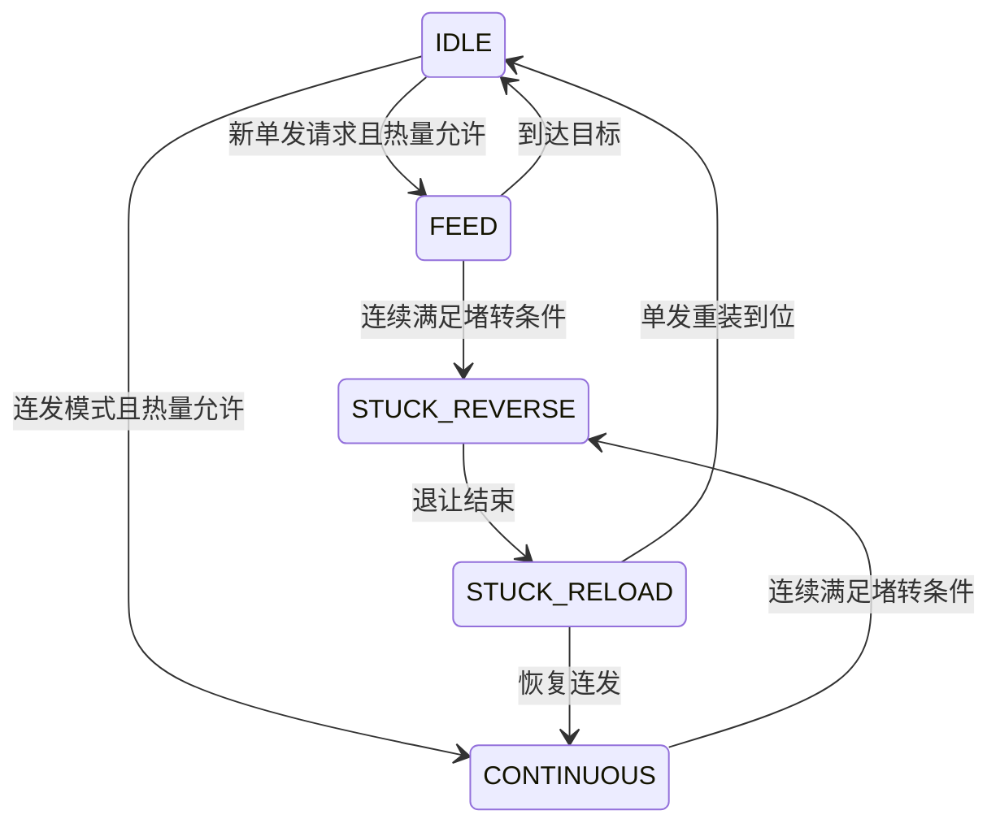

# 发射机构

## 文件和分工

`user/shoot/shoot_control.[ch]` 控制摩擦轮与拨盘动作；`user/tasks/upper_tasks.c` 判断遥控、升降许可、遥控小陀螺互斥和重新布防。驱动在 `bottom_driven/motor/motor3508/motor3508.*`、`dial_motor.*`。裁判与功率控制位于下板，上板从D6接收热量，使用 `shoot_heat.[ch]` 做本地预测、冷却和校准，详见 [热量控制](11_热量控制.md)。

## 执行逻辑

### 待机与位置保持

- 保险：摩擦轮主动减速归零，停止供弹；待发：摩擦轮转动，拨盘等待供弹请求。
- 遥控和拨盘在线时，拨盘保持 `shoot_config.dial.hold_encoder` 指定的单圈位置，到位范围由 `shoot_config.dial.arrived_error_counts` 配置。
- 上线、单发结束、连发停止和中途停射时，按实测单圈码与累计位置换算最近一圈的固定相位目标。保持期间目标固定。
- 摩擦轮关闭、失联、恢复失败或升降未放行时，拨盘继续保持位置，供弹请求被拦截。
- 遥控或拨盘失联时拨盘输出零电流；恢复在线后重新建立固定相位目标。

### 摩擦轮主动停轮

保险、遥控断控和发射许可撤销后，发射任务每周期调用 `Motor3508_BrakeStop()`。两轮按各自实时转速执行目标零速的比例闭环，制动电流与当前转速反向，并受制动电流上限和驱动总限幅约束。进入停止死区后输出零电流，避免低速来回反转。

停轮期间清空原速度环积分，重新开轮从清空后的速度环启动。每轮分别检查反馈时效；未收到或已过期的轮反馈对应零电流，另一轮仍可主动制动。堵转恢复失败的故障分支保留零电流停止。

参数在 `motor3508_config.brake`：`kp` 为停轮比例增益，`current_limit_raw` 为刹车电流幅值上限，`stop_speed_rpm` 为停止死区。默认值在 `Motor3508BrakeConfig_Init()`。观察 `motor3508_brake_state.feedback_valid[]/active[]/current_raw[]`，依次检查反馈有效、主动制动和本周期电流命令；电流命令入队失败时下一周期重发。

停轮帧仍通过升降驱动的共享群组接口发送，保留升降电机槽位。主动停轮需要电调保持供电且反馈可用，完全掉电时无法施加制动力矩。实际停轮时间由摩擦轮惯量、制动增益和电流上限共同决定。

### 单发与连发

- 遥控单发由右拨杆进入上档的边沿触发。
- 单发目标在固定相位上增加 `shoot_config.dial.feed_direction × SHOOT_DIAL_ONE_BULLET_COUNTS`，完成整圈供弹后保持相同单圈位置。
- 连发使用速度闭环；停止时回到最近一圈的固定相位。
- 键鼠短按请求锁存至一发完成，长按进入连续供弹。

保险或许可撤销时取消供弹并保持拨盘位置，失联时发零电流。堵转保存原目标与方向，反向退让，再追目标或恢复连发。停机命令未成功入队时周期重试。拨盘离线时只允许摩擦轮待发，不供弹；所有模式都先发送拨盘帧，再发摩擦轮群组帧；关闭摩擦轮时也保持这个顺序，减少拨盘保持帧因邮箱被占而丢失。

## 摩擦轮弹速自适应

`shoot_speed.[ch]` 根据裁判系统0x0207回传的主17mm枪管弹速调整两轮共同目标转速。下板通过D7转发，上板发射任务读取快照后调用 `ShootSpeed_Update()`，遥控和键鼠共用这条调速链路。

目标弹速为“弹速上限减速度余量”。裁判状态含有效弹速上限时直接采用，否则使用 `fallback_limit_m_s`。每收到一发新的有效测速，低于目标死区就增加一步，高于死区就减少一步，死区内保持。连续转发同一发的测速只处理一次；调速后的等待时间内消费测速序号，但暂停调整。

从 `shoot_config.friction.target_speed_rpm` 起调；开关摩擦轮保留已学习的转速，修改基础转速会重新起调。关闭自适应后使用基础转速。正常输出始终受应用上限、驱动上限和速度命令范围约束。开轮加速、堵转脉冲、恢复观察和故障期间暂停学习，堵转脉冲仍由原电流参数控制。

反馈中断或样本过期时保留当前转速。D7携带测速年龄，旧测速不能在重新开轮或调整转速后补调。当前转速稳定以后产生的新测速才用于调整。

参数位于 `shoot_config.friction.adaptive`，默认值在 `config/application_config.c` 的 `ShootSpeedConfig_Init()`：

| 参数 | 用途 |
| --- | --- |
| `enabled` | 自适应开关 |
| `step_rpm` | 每次反馈调整步长，rpm |
| `margin_m_s` | 目标弹速与上限的余量，m/s |
| `max_speed_rpm` | 正常速度控制转速上限，rpm |
| `deadband_m_s` | 目标附近保持转速的范围，m/s |
| `fallback_limit_m_s` | 裁判未提供弹速上限时使用的上限，m/s |
| `feedback_timeout_ms` | D7板间反馈有效时间，ms |
| `settle_time_ms` | 调速及恢复放行后的稳定等待时间，ms |

Keil展开 `shoot_control_state.speed`：`actual_m_s`为最近有效实测弹速，`target_m_s`为目标弹速，`limit_m_s`为采用的上限，`target_speed_rpm`为正常输出转速，`adjusted_count`为累计调整次数。`feedback_valid`检查测速有效性，`learning`检查当前学习许可，`config_valid`检查配置范围。

上电从基础转速运行，需要实际发射后才获得测速修正。调参时先观察每发弹速和轮速变化，再调整步长、余量和等待时间；弹速死区会占用部分余量。该功能依靠发射后的测速修正，首次弹速及变化过程需要实车核对。

移植时复制 `shoot_speed.[ch]`，提供配置、正常轮速上限、测速序号与时间，以及启动和堵转状态许可。算法无HAL依赖；两板方案还需同步移植D7编解码、过滤器和下板转发任务。

## 摩擦轮堵转恢复

任一轮持续低速且反馈电流较高时触发。开轮启动阶段暂不检测，左右轮分别计时，短暂掉速不会累积为堵转。触发后两轮按 `motor3508_config.left_direction/right_direction` 沿正常出弹方向给短时电流，仍使用原驱动限幅及共享群组帧，不影响升降电流槽。

脉冲及恢复观察阶段停止供弹并保持拨盘位置，随后恢复摩擦轮速度环和原供弹模式；单发中断后需要新的触发。开启期间重试次数用尽后，两轮停机、拨盘保持位置并禁止供弹，关闭摩擦轮再开启才能复位。停射或失联立即取消脉冲。未恢复的堵转可能再次触发，不能无限连续冲击。

参数在 `shoot_config.friction`：`block_speed_rpm`、`shoot_config.friction.block_current_raw`、`shoot_config.friction.block_confirm_ms` 为堵转判据；`shoot_config.friction.startup_grace_ms` 避开启动；`shoot_config.friction.boost_current_raw`、`shoot_config.friction.boost_duration_ms` 为恢复电流和时长；`shoot_config.friction.recovery_wait_ms`、`shoot_config.friction.recovery_max_attempts` 为观察时间和开启期间的重试上限。电流是 C620 原始码。脉冲时长有软件上限，实际发送失败会缩短有效脉冲，不补时。

观察 `shoot_control_state.friction.state/attempts/stuck_count`，分别表示状态、本次开启恢复次数和累计恢复次数。

## 发射阻止原因

| `upper_shoot_block_reason` | 含义 |
| --- | --- |
| `NONE` | 所需许可有效 |
| `REMOTE` | 遥控离线 |
| `LIFT` | 升降位置或安全快照未放行 |
| `SPIN` | 遥控小陀螺与发射互斥；键鼠不受此项限制 |
| `REARM` | 等待物理换档或键鼠重新布防 |
| `FRICTION` | 摩擦轮离线 |
| `DIAL` | 拨盘离线，只允许待发 |

键鼠模式下 G 开启小陀螺后，F 摩擦轮锁存保留，鼠标短按单发、长按连发仍有效；升降许可、在线检测和重新布防照常生效。遥控模式的小陀螺右杆只使能自旋，不能触发发射。

升降或遥控许可恢复后需要重新布防：物理右杆重新换档，或键鼠F重新开启。当前判断有优先级，显示的是首先命中的原因，清掉它后可能显示下一项。

## 接口与排查补充

`shoot_config` 管动作、堵转和时间，`shoot_heat_config` 管热量与射频；`motor3508_config`、`dial_motor_config` 管底层 PID、电流和反馈超时，见配置表。修改周期时换算以周期计数的堵转、稳定阈值。移植需保留输入边沿、统一 CAN 入口和失败重试；拨盘型号或减速比改变时重新核对一发计数和正方向。

## 常用观察变量

### 发射与堵转状态

发射动作数按软件供弹状态计数；枪管实测弹速通过 D7 反馈。热量拦截查看热量模块。

| Watch 表达式 | 单位 / 类型 | 含义 |
| --- | --- | --- |
| `upper_shoot_block_reason` | 枚举 | 发射任务拦截原因，枚举对照见本页。 |
| `shoot_control_state.dial.state` | 枚举 | 拨盘待机、单发、连发或堵转恢复阶段。 |
| `shoot_control_state.dial.target` | 编码器计数 | 拨盘累计供弹或保持目标。 |
| `shoot_control_state.dial.target_synced` | bool | 累计目标已经根据当前编码器建立。 |
| `shoot_control_state.stop.holding` | bool | 待机固定相位保持目标已锁定。 |
| `shoot_control_state.keyboard.single_pending` | bool | 存在尚待执行的键鼠单发请求。 |
| `shoot_control_state.keyboard.single_active` | bool | 正在完成一次键鼠单发。 |
| `shoot_control_state.recovery.block_tick` | 控制周期数 | 拨盘堵转条件连续满足的周期数。 |
| `shoot_control_state.recovery.feed_target` | 编码器计数 | 堵转退让前保存的供弹终点。 |
| `shoot_control_state.friction.state` | 枚举 | 摩擦轮正常、强电流恢复、观察恢复或故障状态。 |
| `shoot_control_state.friction.attempts` | 次 | 当前开轮期间已使用的恢复次数。 |
| `shoot_control_state.friction.stuck_count` | 次 | 摩擦轮堵转恢复累计次数。 |
| `shoot_control_state.count.single` | 次 | 单发到位或超时退出累计次数，含堵转重装后结束的单发。 |
| `shoot_control_state.count.stuck` | 次 | 拨盘堵转恢复累计次数。 |

### 弹速自适应

排查调速时同时记录实际弹速、目标弹速、目标转速和调整次数。

| Watch 表达式 | 单位 / 类型 | 含义 |
| --- | --- | --- |
| `shoot_control_state.speed.target_speed_rpm` | 转子 rpm | 正常速度控制实际采用的摩擦轮转速幅值。 |
| `shoot_control_state.speed.actual_m_s` | m/s | 最近消费的枪管实测弹速。 |
| `shoot_control_state.speed.target_m_s` | m/s | 扣除速度余量后的目标弹速。 |
| `shoot_control_state.speed.limit_m_s` | m/s | 当前采用的弹速上限。 |
| `shoot_control_state.speed.adjusted_count` | 次 | 已经执行的转速调整次数。 |
| `shoot_control_state.speed.learning` | bool | 当前状态允许自适应学习。 |
| `shoot_control_state.speed.feedback_valid` | bool | 最近测速反馈仍在有效期内。 |
| `shoot_control_state.speed.config_valid` | bool | 自适应配置检查通过。 |
| `shoot_control_state.speed.sequence` | 序号 | 最近消费的测速样本序号。 |

完整速查与观察方法见 [本板观察变量速查](00_观察变量速查.md)。

[返回工程首页](../README.md)
