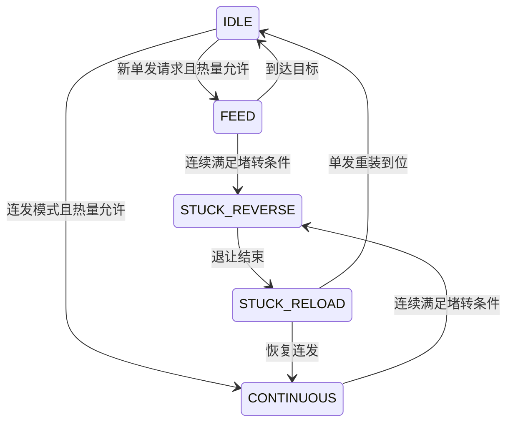

# 发射机构

## 文件和分工

`user/shoot/shoot_control.[ch]` 控制摩擦轮与拨盘动作；`user/tasks/upper_tasks.c` 判断遥控、升降许可、遥控小陀螺互斥和重新布防。驱动在 `bottom_driven/motor/motor3508/motor3508.*`、`dial_motor.*`。裁判与功率控制位于下板，上板从D6接收热量，使用 `shoot_heat.[ch]` 做本地预测、冷却和校准，详见 [热量控制](11_热量控制.md)。

## 执行逻辑

### 待机与位置保持

- 保险：停止摩擦轮与供弹；待发：摩擦轮转动，拨盘等待供弹请求。
- 遥控和拨盘在线时，拨盘保持 `shoot_config.dial.hold_encoder` 指定的单圈位置，到位范围由 `shoot_config.dial.arrived_error_counts` 配置。
- 上线、单发结束、连发停止和中途停射时，按实测单圈码与累计位置换算最近一圈的固定相位目标。保持期间目标固定。
- 摩擦轮关闭、失联、恢复失败或升降未放行时，拨盘继续保持位置，供弹请求被拦截。
- 遥控或拨盘失联时输出零电流；恢复在线后重新建立固定相位目标。

### 单发与连发

- 遥控单发由右拨杆进入上档的边沿触发。
- 单发目标在固定相位上增加 `shoot_config.dial.feed_direction × SHOOT_DIAL_ONE_BULLET_COUNTS`，完成整圈供弹后保持相同单圈位置。
- 连发使用速度闭环；停止时回到最近一圈的固定相位。
- 键鼠短按请求锁存至一发完成，长按进入连续供弹。

保险或许可撤销时取消供弹并保持拨盘位置，失联时发零电流。堵转保存原目标与方向，反向退让，再追目标或恢复连发。停机命令未成功入队时周期重试。拨盘离线时只允许摩擦轮待发，不供弹；所有模式都先发送拨盘帧，再发摩擦轮群组帧；关闭摩擦轮时也保持这个顺序，减少拨盘保持帧因邮箱被占而丢失。

## 摩擦轮堵转恢复

任一轮持续低速且反馈电流较高时触发。开轮启动阶段暂不检测，左右轮分别计时，短暂掉速不会累积为堵转。触发后两轮按 `motor3508_config.left_direction/right_direction` 沿正常出弹方向给短时电流，仍使用原驱动限幅及共享群组帧，不影响升降电流槽。

脉冲及恢复观察阶段停止供弹并保持拨盘位置，随后恢复摩擦轮速度环和原供弹模式；单发中断后需要新的触发。开启期间重试次数用尽后，两轮停机、拨盘保持位置并禁止供弹，关闭摩擦轮再开启才能复位。停射或失联立即取消脉冲。未恢复的堵转可能再次触发，不能无限连续冲击。

参数在 `shoot_config.friction`：`block_speed_rpm`、`shoot_config.friction.block_current_raw`、`shoot_config.friction.block_confirm_ms` 为堵转判据；`shoot_config.friction.startup_grace_ms` 避开启动；`shoot_config.friction.boost_current_raw`、`shoot_config.friction.boost_duration_ms` 为恢复电流和时长；`shoot_config.friction.recovery_wait_ms`、`shoot_config.friction.recovery_max_attempts` 为观察时间和开启期间的重试上限。电流是 C620 原始码。脉冲时长有软件上限，实际发送失败会缩短有效脉冲，不补时。

观察 `shoot_control_state.friction.state/attempts/stuck_count`，分别表示状态、本次开启恢复次数和累计恢复次数。

## 发射阻止原因

| `upper_shoot_block_reason` | 含义 |
| --- | --- |
| `NONE` | 所需许可有效 |
| `REMOTE` | 遥控离线 |
| `LIFT` | 升降位置或安全快照未放行 |
| `SPIN` | 遥控小陀螺与发射互斥；键鼠不受此项限制 |
| `REARM` | 等待物理换档或键鼠重新布防 |
| `FRICTION` | 摩擦轮离线 |
| `DIAL` | 拨盘离线，只允许待发 |

键鼠模式下 G 开启小陀螺后，F 摩擦轮锁存保留，鼠标短按单发、长按连发仍有效；升降许可、在线检测和重新布防照常生效。遥控模式的小陀螺右杆只使能自旋，不能触发发射。

升降或遥控许可恢复后需要重新布防：物理右杆重新换档，或键鼠F重新开启。当前判断有优先级，显示的是首先命中的原因，清掉它后可能显示下一项。

## 状态变量与参数

`shoot_control_state.dial` 保存拨盘状态、目标与同步状态；`recovery` 保存堵转周期数、原目标与方向；`stop` 保存待机保持目标是否锁定及零电流停机是否成功入队；`remote/keyboard` 保存输入边沿和事件消费；`count.single/stuck` 为累计统计。`dial_motor_tx_diagnostics` 可区分发送间隔拦截、邮箱满与HAL失败。

`shoot_config` 管动作、堵转和时间，`shoot_heat_config` 管热量与射频；`motor3508_config`、`dial_motor_config` 管底层PID/电流/反馈超时，见配置表。修改周期时换算以周期计数的堵转/稳定阈值。移植需保留输入边沿、统一CAN群组和失败重试；拨盘型号或减速比改变时重新核对一发计数和正方向。

[返回工程首页](../README.md)
