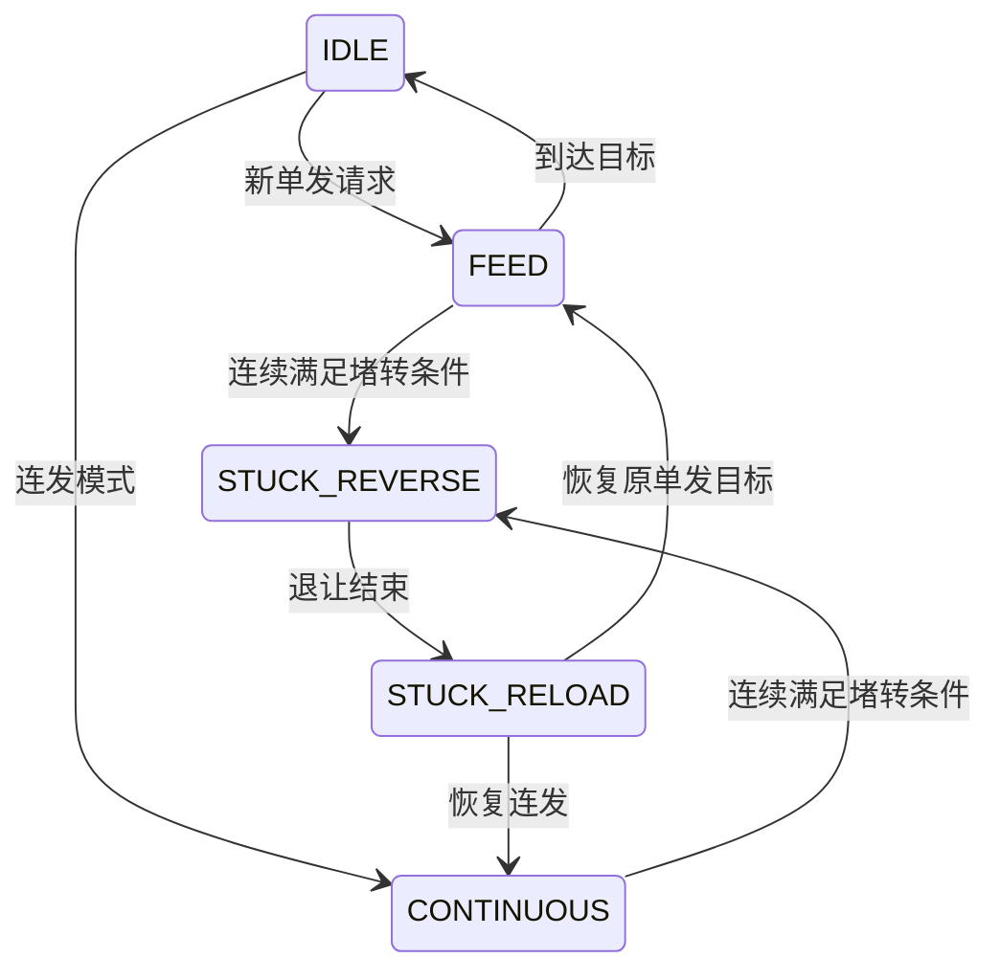

# 发射机构

## 文件和分工

`user/shoot_control.[ch]` 控制摩擦轮与拨盘动作；`user/upper_tasks.c` 先判断遥控、升降、小陀螺互斥和重新布防。驱动在 `bottom_driven/motor/motor3508.*`、`dial_motor.*`。目前没有裁判热量闭环；裁判与功率控制在下板，不能把下板热量数据已解析理解为上板已经限热。

## 执行逻辑

保险停止摩擦轮与供弹，待发只转摩擦轮。物理单发在右杆进入上档边沿增加一个拨弹位置目标；连发用速度闭环。键鼠短按事件锁存至一发完成，长按按遥控状态进入连续供弹。单发一次目标增加 `SHOOT_DIAL_ONE_BULLET_COUNTS`，该计数与拨盘协议有关。

保险、离线或许可撤销时停止并取消对应请求。堵转保存原目标与方向，反向退让，再追目标或恢复连发。停机命令未成功入队时周期重试。拨盘离线时只允许摩擦轮待发，不供弹；拨盘控制先入队，再发摩擦轮群组帧以减少邮箱竞争。

## 发射阻止原因

| `upper_shoot_block_reason` | 含义 |
| --- | --- |
| `NONE` | 所需许可有效 |
| `REMOTE` | 遥控离线 |
| `LIFT` | 升降位置或安全快照未放行 |
| `SPIN` | 小陀螺与发射互斥 |
| `REARM` | 等待物理换档或键鼠重新布防 |
| `FRICTION` | 摩擦轮离线 |
| `DIAL` | 拨盘离线，只允许待发 |

许可恢复不会自动补执行旧供弹：物理右杆重新换档，或键鼠F重新开启。当前判断有优先级，显示的是首先命中的原因，清掉它后可能显示下一项。

## 状态变量与参数

`shoot_control_state.dial` 保存拨盘状态、目标与同步状态；`recovery` 保存堵转周期数、原目标与方向；`stop` 保存停机是否成功入队；`remote/keyboard` 保存输入边沿和事件消费；`count.single/stuck` 为累计统计。`dial_motor_tx_diagnostics` 可区分发送间隔拦截、邮箱满与HAL失败。

`shoot_config` 管动作、堵转和时间；`motor3508_config`、`dial_motor_config` 管底层PID/电流/反馈超时，见配置表。修改周期时换算以周期计数的堵转/稳定阈值。移植需保留输入边沿、统一CAN群组和失败重试；拨盘型号或减速比改变时重新核对一发计数和正方向。

[返回工程首页](../README.md)
