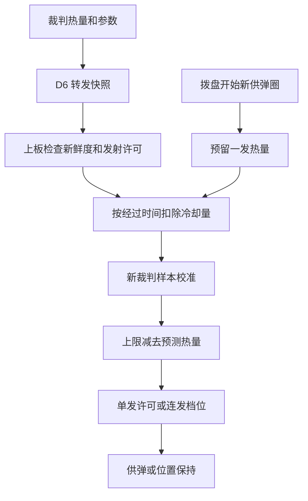

# 热量控制

## 文件与数据链

`user/shoot/shoot_heat.[ch]` 维护本地热量、裁判校准和允许射频，`shoot_control.c` 在供弹动作中计热、限制射频和停止新供弹。下板解析裁判消息后，通过 D6 向上板转发热量、上限、冷却值及发射电源许可。

下板原始变量：

- 当前热量：`referee_state.info.power_heat_data.shooter_17mm_1_barrel_heat`。
- 热量上限：`referee_state.info.robot_status.shooter_barrel_heat_limit`。
- 每秒冷却量：`referee_state.info.robot_status.shooter_barrel_cooling_value`。

## 本地计热与校准

每周期按 `预测热量 = max(0, 原热量−冷却值×经过秒数)` 更新。新单发开始前预留 `heat_per_shot`。连发起动前预留第一发，拨盘每越过新的正向整圈后，允许继续供弹时预留下一发。堵转退让和重装沿用原预留，避免重复计热。

射击过程中，新裁判样本只把预测热量向上校准。停止供弹并等待 `calibration_settle_ms` 后，新样本可将预测热量同步到裁判值，消除空弹链和中断动作造成的多计热量。同一热量消息重复转发时序号不变，上板只做一次校准。

供弹位置用于预测发数。空弹链也会先计热，待停射校准后修正；实际热量以枪口检测和裁判反馈为准。

## 发射条件与档位

剩余热量为 `max(0, 热量上限−预测热量)`。

| 剩余热量 | 单发 | 连发目标射频 |
| --- | --- | --- |
| ≤20 | 禁止新供弹 | 停止新供弹 |
| >20 且 ≤50 | 允许 | 3 发/秒 |
| >50 且 <100 | 允许 | 10 发/秒 |
| ≥100 | 允许 | 15 发/秒 |

单发判断在本发计热前进行，预留后余量降到停止阈值仍会完成这一发。连发也允许已预留的末发完成，其终点使用附加速度限幅的位置闭环，完成后停止新供弹并保持固定相位。

阈值和射频集中在 `shoot_heat_config`。到 50 时按低射频档，到 100 时按高射频档。实际射频还受电机能力、机械卡滞和摩擦轮状态影响。

## 失联和调试

默认 `enabled=true`、`allow_offline=false`：没有有效热量、状态消息过期、D6 超时或裁判关闭发射电源时禁止供弹。摩擦轮沿用原待发逻辑，遥控与拨盘在线时继续保持拨盘位置。

离线调车可设 `allow_offline=true`，仍执行本地热量限制。尚无裁判初值时使用 `offline_heat_limit/offline_cooling_per_s`，曾收到裁判参数时沿用最近值。`enabled=false` 可暂时关闭热量和射频限制，有效裁判的发射断电许可仍生效。

热量恢复后，持续连发输入可恢复供弹；被拒绝的单发请求已消费，需要新的单发操作。热量阻止独立于升降和遥控重新布防，不锁存新的手动布防要求。

## Watch 与排查

展开 `shoot_heat_state`：

| 成员 | 用途 |
| --- | --- |
| `predicted_heat` / `referee_heat` | 本地预测值、最近裁判值 |
| `heat_limit` / `cooling_per_s` | 当前生效的上限与冷却量 |
| `remaining` / `continuous_rate_hz` | 剩余热量、允许的新供弹射频 |
| `referee_valid` / `output_allowed` | 数据有效性、裁判发射电源许可 |
| `config_valid` / `initialized` | 参数合法性、初值是否建立 |
| `predicted_shots` / `calibration_count` | 预留发数、新裁判样本次数 |
| `sample_sequence` / `last_feed_ms` | 校准样本序号、最近供弹活动时间 |

`continuous_rate_hz=0` 表示不能开始新一发；已预留的末发可能仍在完成。`upper_shoot_block_reason` 显示遥控、升降、电机与布防原因，热量原因通过本结构查看。

## 复用与移植

纯热量模块只依赖标准 C，可用于按固定单发热量和冷却速率计热的发射机构。复制 `shoot_heat.[ch]` 和配置，在启动调用 `ShootHeat_Init()`，每周期先 `ShootHeat_Update()`，开始新供弹前检查 `ShootHeat_CanStart()` 并调用 `ShootHeat_RecordShot()`，连发速度由 `ShootHeat_GetRate()` 获取。

输入包含有效性、发射电源许可、新样本序号、当前热量、上限与每秒冷却量。单发与堵转重试共享同一次预留，重新起动的连发建立新的累计位置基准。多枪管移植时每根枪管需要独立的热量状态和参数。

[返回工程首页](../README.md)
