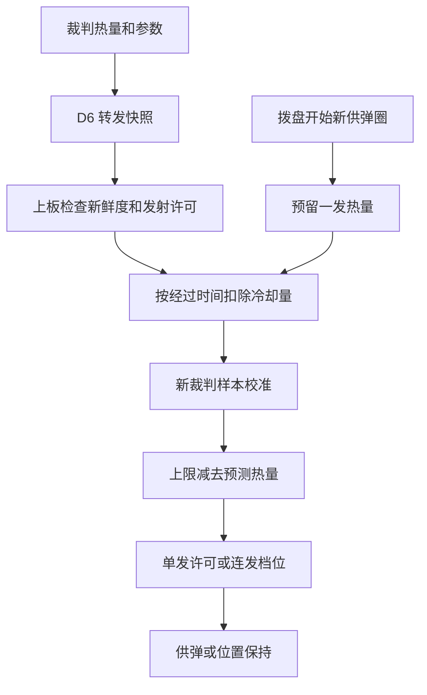

# 热量控制

## 文件与数据链

`user/shoot/shoot_heat.[ch]` 维护本地热量、裁判校准和允许射频，`shoot_control.c` 在供弹动作中计热、限制射频和停止新供弹。下板解析裁判消息后，通过 D6 向上板转发热量、上限、冷却值及发射电源许可。

下板原始变量：

- 当前热量：`referee_state.info.power_heat_data.shooter_17mm_1_barrel_heat`。
- 热量上限：`referee_state.info.robot_status.shooter_barrel_heat_limit`。
- 每秒冷却量：`referee_state.info.robot_status.shooter_barrel_cooling_value`。

## 本地计热与校准

每周期按 `预测热量 = max(0, 原热量−冷却值×经过秒数)` 更新。新单发开始前预留 `heat_per_shot`。连发起动前预留第一发，拨盘每越过新的正向整圈后，允许继续供弹时预留下一发。堵转退让和重装沿用原预留，避免重复计热。

新裁判样本支持双向校准。每次供弹记录预留时间和当时的单发热量，在 `calibration_settle_ms` 窗口内计入 `recent_reserved_heat`。校准时将预测值限制在“裁判当前热量”至“裁判当前热量加近期预留”的区间内，保留反馈尚未覆盖的供弹，同时消除较早的多计热量。连续供弹也执行这一步，无需松开发射输入。

同一热量消息重复转发时序号不变，上板只做一次校准。近期记录到期只释放校准边界，实际预测值在下一次新裁判样本到来时修正；停止供弹并等保护窗口结束后可直接同步裁判值。记录容量满时将额外预留合并，等待最后一笔合并记录到期再释放。

供弹位置用于预测发数。空弹链也会先计热，保护窗口结束后由新裁判样本修正；实际热量以枪口检测和裁判反馈为准。保护窗口应覆盖供弹到测速、裁判更新和板间转发的延迟。

## 发射条件与档位

剩余热量为 `max(0, 热量上限−预测热量)`。

| 剩余热量 | 单发 | 连发目标射频 |
| --- | --- | --- |
| ≤`stop_remaining` | 禁止新供弹 | 停止新供弹 |
| >`stop_remaining` 且 ≤`low_remaining` | 允许 | `low_rate_hz` |
| >`low_remaining` 且 <`high_remaining` | 允许 | `middle_rate_hz` |
| ≥`high_remaining` | 允许 | `high_rate_hz` |

单发判断在本发计热前进行，预留后余量降到停止阈值仍会完成这一发。连发也允许已预留的末发完成，末发使用低档速度闭环，到达供弹终点后停止新供弹，再回最近一圈的固定相位保持。供弹期间不切位置保持，堵转退让和重装沿用原位置控制。

阈值和射频集中在 `shoot_heat_config`。到低速档上界时按低射频档，到高速档下界时按高射频档。连发每周期按最新余量更新拨盘目标角速度，换算为 `供弹方向×360×射频`，单位为度/秒。实际射频还受电机能力、机械卡滞和摩擦轮状态影响。

## 失联和调试

默认 `enabled=true`、`allow_offline=false`：没有有效热量、状态消息过期、D6 超时或裁判关闭发射电源时禁止供弹。摩擦轮沿用原待发逻辑，遥控与拨盘在线时继续保持拨盘位置。

离线调车可设 `allow_offline=true`，仍执行本地热量限制。尚无裁判初值时使用 `offline_heat_limit/offline_cooling_per_s`，曾收到裁判参数时沿用最近值。`enabled=false` 可暂时关闭热量和射频限制，有效裁判的发射断电许可仍生效。

热量恢复后，持续连发输入可恢复供弹；被拒绝的单发请求已消费，需要新的单发操作。热量阻止独立于升降和遥控重新布防，不锁存新的手动布防要求。

## 复用与移植

纯热量模块只依赖标准 C，可用于按固定单发热量和冷却速率计热的发射机构。复制 `shoot_heat.[ch]` 和配置，在启动调用 `ShootHeat_Init()`，每周期先 `ShootHeat_Update()`，开始新供弹前检查 `ShootHeat_CanStart()` 并调用 `ShootHeat_RecordShot()`，连发速度由 `ShootHeat_GetRate()` 获取。

输入包含有效性、发射电源许可、新样本序号、当前热量、上限与每秒冷却量。单发与堵转重试共享同一次预留，重新起动的连发建立新的累计位置基准。多枪管移植时每根枪管需要独立的热量状态和参数。

## 常用观察变量

推荐同时画预测热量、裁判热量、剩余量和允许射频。射频为零时停止开始新一发，已经预留的末发继续按动作逻辑完成。

| Watch 表达式 | 单位 / 类型 | 含义 |
| --- | --- | --- |
| `shoot_heat_state.predicted_heat` | 热量值 | 本地预测并经裁判校准后的当前热量。 |
| `shoot_heat_state.referee_heat` | 热量值 | 最近消费的裁判热量样本。 |
| `shoot_heat_state.recent_reserved_heat` | 热量值 | 反馈保护窗口内仍保留的供弹热量。 |
| `shoot_heat_state.heat_limit` | 热量值 | 当前生效的热量上限。 |
| `shoot_heat_state.cooling_per_s` | 热量值/s | 当前生效的冷却速率。 |
| `shoot_heat_state.remaining` | 热量值 | 当前可用热量余量。 |
| `shoot_heat_state.continuous_rate_hz` | 发/s | 当前允许的新供弹射频。 |
| `shoot_heat_state.referee_valid` | bool | 裁判热量与状态参数有效。 |
| `shoot_heat_state.output_allowed` | bool | 裁判允许发射电源输出。 |
| `shoot_heat_state.config_valid` | bool | 热量配置检查通过。 |
| `shoot_heat_state.initialized` | bool | 已经建立本地热量初值。 |
| `shoot_heat_state.predicted_shots` | 发 | 本地累计预留的供弹发数。 |
| `shoot_heat_state.calibration_count` | 次 | 已消费的新裁判样本校准次数。 |
| `shoot_heat_state.sample_sequence` | 序号 | 最近处理的热量样本序号。 |
| `shoot_heat_state.last_feed_ms` | ms | 最近一次供弹活动或热量预留时间。 |

完整速查与观察方法见 [本板观察变量速查](00_观察变量速查.md)。

[返回工程首页](../README.md)
